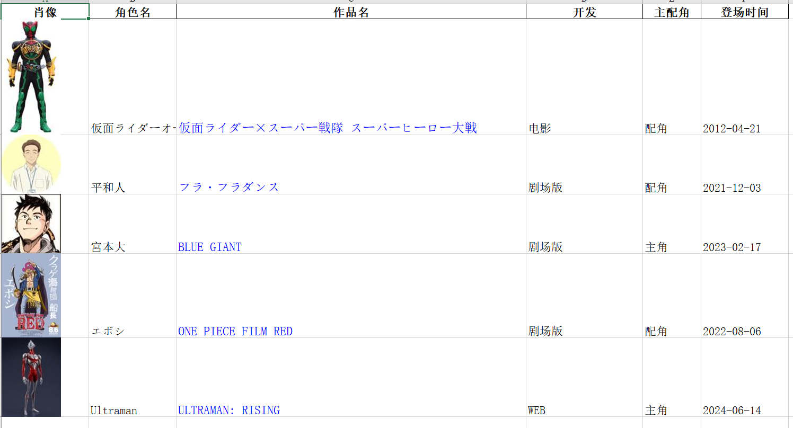

# bangumi-cv-character-list  

bangumi cv character list (in descending order by time)  

读取bangumi的cv列表存在本地,利用excel的筛选排序功能实现时间倒序 

本项目request相关代码来自于https://github.com/jerrylususu/bangumi-takeout-py,相关警告请查阅该项目

使用样例:(test on windows)  

python .\main.py --id 34198  

